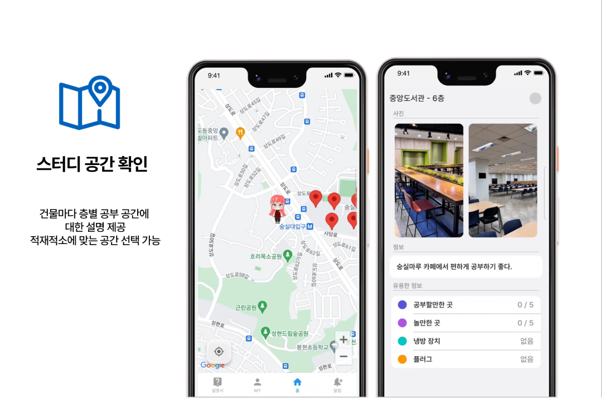

https://youtu.be/g-nvEGqqels

## 서비스 소개

- 도서관에서 공부할 자리가 부족함
- 교내에서 팀플을 할 수 있는 적절한 공간이 부족함

→ 학교 곳곳에 숨어있는 공부 공간을 소개하는 지도를 만들어보자!

- 총학생회 인스타그램 게시물을 자주 확인하지 않으면 교내 활동에 참여하기 어려움

→ 총학생회 게시물을 행사 알림으로 간단하게 받아보자!

## 주요 기능

- 학교 곳곳에 숨어있는 공부 공간을 총 망라함
- 콘센트 유무, 냉방시설 유무 등 장소에 대한 세부 정보도 제공

- 파이썬 크롤링 봇을 활용하여 새로운 인스타그램 게시물을 감지
- Firebase을 통해 고객에게 요약된 정보를 알림으로 제공

- 캐릭터의 구성요소를 사용자가 직접 선택 가능
- 선택한 캐릭터가 지도에서 현재 위치를 나타냄

## 주요 업무

- Figma 프로토타이핑
- 공간 세부 정보 창 프론트엔드 개발
- 파이썬 크롤링 봇과 Firebase API 연결

## 사용한 기술 스택

- Dart (Flutter)
- Python
- Figma

## 소스 코드

https://github.com/SSU-Team-Project