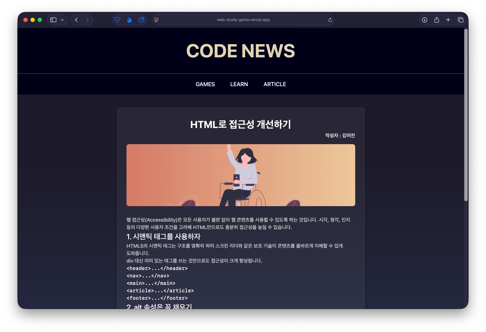

https://web-study-game.vercel.app

## 서비스 소개

- 문법만 외우는 딱딱한 학습은 금방 지루해짐
- 실무 경험이 없어 오류 해결 경험이 부족함

→ 재미있게 학습할 수 있는 서사가 있는 버그 해결 게임을 만들어보자!

- 웹에 대한 자료, 사이트 등 정보가 너무 많아 찾기 어려움

→ 웹 개발에 대한 정보를 한 곳에 모아보자!

## 주요 기능

웹 프로그래밍에 대한 기초 지식을 바탕으로 스토리형 게임을 진행한다.

잘못된 HTML/CSS 코드 속 버그를 찾아 수정하며 학습한다.

해결한 문제를 개념 별로 요약해주는 탐정 수첩을 제공한다.

웹 관련 정보, 소식들을 뉴스 기사처럼 제공한다.

## 주요 업무

- Figma 프로토타이핑
- 아티클 페이지 프론트엔드 개발
- 개념 학습 페이지 프론트엔드 개발

## 사용한 기술 스택

- HTML5
- CSS3
- JavaScript
- Vite

## 소스 코드

https://github.com/Global-Media-Web-Programming/WebStudyGame
